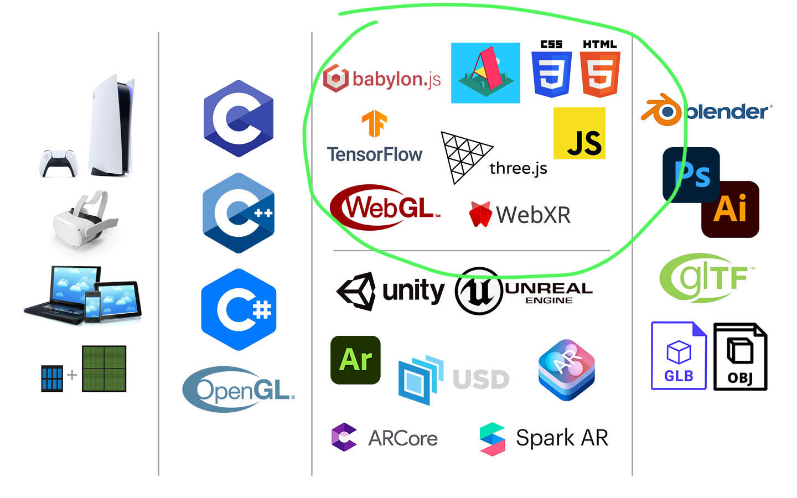
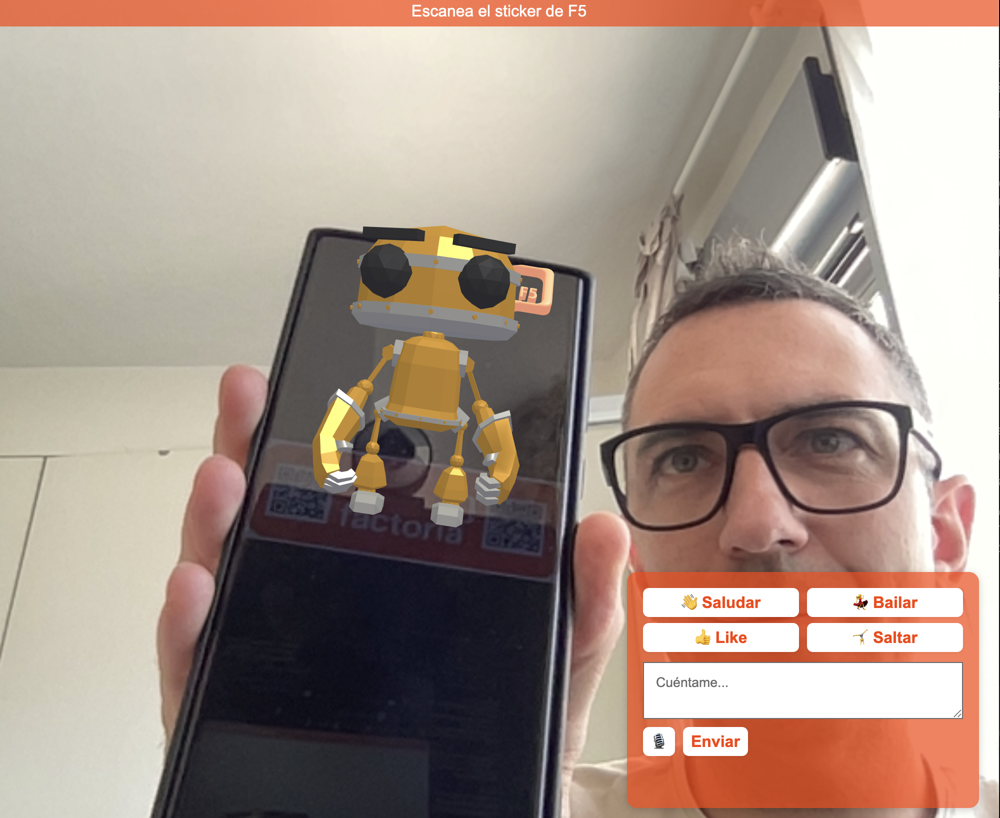

# Experiencia AR con Factoría F5 🤖✨ 

**Realidad Aumentada Interactiva con Chat IA para Factoría F5**

<br>
<br>
<br>
<br>

## 📋 **Índice**

### 🎯 **Fundamentos y Conceptos**
- [¿Qué vas a aprender?](#-qué-vas-a-aprender-en-esta-guía)
- [Conceptos Fundamentales: AR, VR, XR](#-conceptos-fundamentales-ar-vr-xr-y-más)
- [Ejemplos Reales: Casos de Uso](#-ejemplos-reales-casos-de-uso-en-el-mundo)
- [La Filosofía de la Innovación](#-la-filosofía-de-la-innovación-combinar-no-solo-crear)

### 🏗️ **Proyecto**
- [Descripción del Proyecto](#-descripción)
- [Características Principales](#-características-principales)
- [Arquitectura del Proyecto](#-arquitectura-del-proyecto)

### 🚀 **Implementación y Uso**
- [Instalación](#-instalación)
- [Uso](#-uso)

### 🌐 **Recursos y herramientas**
- [Tecnologías Utilizadas](#-tecnologías-utilizadas)
- [Más recursos interesantes](#-más-recursos-interesantes)

### 🎯[TODO](#-todo)

---

<br>
<br>
<br>
<br>

## 🎯 **Fundamentos y Conceptos**
<br>

### 🎓 ¿Qué vas a aprender en esta guía?

Esta es tu **clase completa** para entender, construir y personalizar una aplicación de Realidad Aumentada (AR) desde cero.

**Nivel**: Intermedio  
**Tiempo estimado**: 2 horas  
**Prerrequisitos**: Conocimientos básicos de HTML, CSS y JavaScript  

<br>

### 📚 Conceptos Fundamentales: AR, VR, XR y Más

🔍 **Realidad Aumentada (AR)**

Definición: Superposición de objetos digitales en el mundo real a través de dispositivos.

Características:
- ✅ Mantiene el mundo real como base
- ✅ Añade información digital superpuesta
- ✅ Interacción en tiempo real con el entorno
- ✅ Ejemplo: Pokemon Go, filtros de Instagram, Google Maps

<br>

🥽 **Realidad Virtual (VR)**

Definición: Entorno completamente digital en el que el usuario puede interactuar a través de cascos de VR.

Características:
- ✅ Mundo completamente digital
- ✅ Inmersión total del usuario
- ✅ Interacción con objetos virtuales
- ✅ Ejemplo: Oculus Quest, PlayStation VR

<br>

🌐 **Realidad Extendida (XR)**

Definición: Un término que engloba AR, VR y otras tecnologías inmersivas.

Características:
- ✅ Paraguas conceptual para todas las realidades
- ✅ Incluye AR, VR, MR (Realidad Mixta)
- ✅ Evoluciona constantemente con nuevas tecnologías

<br>

⚠️ **Distinciones Importantes**

"No es lo mismo hablar de 3D que de tecnologías inmersivas o metaverso."

| Concepto | Definición | Ejemplo |
|----------|------------|---------|
| **3D** | Gráficos tridimensionales | Modelo 3D de una casa |
| **Inmersivo** | Experiencia envolvente | AR que te rodea |
| **Metaverso** | Interacción entre usuarios | Roblox, Second Life |

**💡 Clave**: El **3D** es solo la **forma**, lo **inmersivo** es la **experiencia**, y el **metaverso** es la **socialización**.

<br>

### 📊 **Mapa Visual de Tecnologías Inmersivas**



*Diagrama de las tecnologías relacionadas con AR, VR, XR y experiencias inmersivas.*

<br>

> [!TIP]
> 🚨 **Preguntas de Control: AR, VR y XR**
> 
> **1. ¿Cuál es la diferencia principal entre AR y VR?**
> - 🔵 AR superpone contenido digital al mundo real, VR crea un entorno completamente virtual
> - 🔴 AR y VR son lo mismo, solo cambia el nombre
> - 🟢 AR es solo para móviles, VR solo para ordenadores
> 
> **2. ¿Qué significa XR?**
> - 🔵 Realidad Extendida: término que engloba AR, VR y otras tecnologías inmersivas
> - 🔴 Realidad Extra: versión mejorada de la realidad virtual
> - 🟢 Realidad Exclusiva: solo para usuarios premium
> 
> **3. ¿Por qué es importante distinguir entre 3D e inmersivo?**
> - 🔵 3D es solo la forma, lo inmersivo es la experiencia envolvente
> - 🔴 No hay diferencia, son sinónimos
> - 🟢 3D es más caro que lo inmersivo

<br>

### 🌟 Ejemplos Reales: Casos de Uso en el Mundo

 🚀 **NASA: IA + Visualización 3D**
- **Proyecto**: [NASA Engineers Help Create a Virtual World of Data](https://www.nasa.gov/feature/nasa-engineers-help-create-a-virtual-world-of-data)
- **Uso**: Identificación rápida de relaciones en datos complejos
- **Tecnología**: IA + Visualizaciones 3D inmersivas
- **Resultado**: Análisis de datos más eficiente y comprensible

<br>

 🏥 **Philips: Instrucciones en Tiempo Real**
- **Proyecto**: [Philips Instrucciones de Primeros Auxilios en Vivo](https://www.philips.com/a-w/about/news/archive/standard/news/press/2018/20181218-philips-helps-first-responders-save-lives-with-augmented-reality.html)
- **Uso**: Instrucciones AR para salvar vidas
- **Tecnología**: AR + Guías visuales en tiempo real
- **Resultado**: Mejor respuesta en emergencias médicas

<br>

🏥 **Hospital de Bellvitge: VR para Pacientes**
- **Proyecto**: [La Realidad Virtual Reduce el Dolor y Ansiedad en Pacientes de UCI](https://www.bellvitgehospital.cat/es/noticias/la-realidad-virtual-reduce-el-dolor-y-ansiedad-en-pacientes-de-uci)
- **Uso**: Reducción de dolor y ansiedad en UCI
- **Tecnología**: VR inmersiva + Terapia distracción
- **Resultado**: Mejora significativa en el bienestar del paciente

<br>

🏛️ **Pirámide de Meroe: AR Cultural**
- [**Proyecto**: Pirámide de Meroe](https://artsexperiments.withgoogle.com/meroe/)
- **Uso**: Experiencia AR educativa de patrimonio cultural
- **Tecnología**: AR + Google Arts & Culture
- **Resultado**: Acceso inmersivo a monumentos históricos

<br>

**Mapas inmersivos** [Google AR Developers](https://developers.google.com/ar)

> [!NOTE]
> 🌍 **Nota sobre Turismo en España**: En España tenemos mucho turismo, lo que hace que las aplicaciones AR para patrimonio cultural y turístico sean especialmente relevantes y valiosas para el mercado local e internacional.

<br>

### 🚂 La Filosofía de la Innovación: Combinar, No Solo Crear

**"La genialidad no siempre está en inventar algo nuevo, sino en combinar tecnologías existentes de manera novedosa."**

Este proyecto es un **ejemplo** de esta filosofía. 

Como el **ferrocarril** que combinó:
- 🛤️ **Vías de tren** (infraestructura existente)
- 🔥 **Máquina de vapor** (tecnología existente)

**La web** es la mayor demostración de que la combinación de tecnologías existentes puede crear algo revolucionario y gratuito.

La **gratuidad** y **apertura** de la web no vino de inventar nuevas tecnologías, sino de **combinar** herramientas existentes de manera **accesible y abierta**.

**La web nos enseñó que:**
1. **Lo gratuito** puede ser **más poderoso** que lo costoso
2. **Lo abierto** puede ser **más innovador** que lo cerrado
3. **La combinación** puede ser **más valiosa** que la invención

> [!NOTE]
> **La araña no es solo la araña, es también la red que teje**
> **Exaptación**: Aplicar un avance en un campo en otro, como hace la naturaleza. Las mejores innovaciones a menudo vienen de adaptar soluciones existentes a nuevos contextos.

<br>
<br>
<br>
<br>

## 🏗️ **Proyecto**
<br>

### 🎯 Descripción

La experiencia AR con Factoría F5 es una aplicación web de realidad aumentada que permite a los usuarios:
- Escanear un sticker de F5 para activar contenido 3D
- Interactuar con un robot 3D animado
- Chatear con texto y en modo voz
- Controlar animaciones del robot mediante botones o comandos de voz

<br>

### ✨ Características Principales

🎮 Realidad Aumentada
- **Escaneo de imagen objetivo** usando MindAR
- **Modelos 3D interactivos** (robot y logo F5)
- **Botones de animación** para control directo

🤖 Animaciones del Robot
- 👋 **Saludar** - Animación de saludo
- 💃 **Bailar** - Movimiento de baile
- 👍 **Like** - Pulgar hacia arriba
- 🤸 **Saltar** - Movimiento de salto
- 😴 **Idle** - Estado de reposo

💬 Sistema de Chat IA
- **Interfaz de chat**
- **Reconocimiento de voz** (español) 
- **Síntesis de voz** para respuestas
- **Integración con backend de IA**

<br>

### 🏗️ Arquitectura del Proyecto

```
f5-ar/
├── front/                  # Frontend AR (experiencia principal)
│   ├── index.html         # Punto de entrada HTML
│   ├── css/
│   │   └── style.css      # Estilos con variables CSS
│   ├── js/
│   │   ├── main.js        # Lógica principal de AR (MindAR + Three.js)
│   │   ├── ar-chat.js     # Sistema de chat y animaciones
│   │   ├── loader.js      # Utilidades de carga de modelos 3D
│   │   └── GLTFLoader.js  # Cargador de modelos GLTF/GLB
│   └── assets/            # Modelos 3D y recursos
│       ├── robot.glb      # Modelo del robot con animaciones
│       ├── f5.gltf        # Logo de F5
│       └── targets.mind   # Marcadores AR compilados
├── back/                   # Backend Node.js (reemplaza PHP)
│   ├── server.js          # Servidor Express con OpenAI
│   ├── package.json       # Dependencias Node.js
│   ├── .env               # Variables de entorno (API keys)
│   └── README.md          # Documentación del backend
└── front2/                 # Versión alternativa del frontend
    ├── index.html         # Variante con diferentes colores
    ├── css/
    │   └── style.css      # Estilos con esquema de colores alternativo
    └── js/                # Mismos archivos JS que front/
```

### 🔄 Flujo de Datos

```
Usuario → Frontend AR → Backend Node.js → OpenAI API → Respuesta IA → Chat AR
```

### 🚀 Tecnologías Utilizadas

- **Frontend**: HTML5, CSS3, JavaScript ES6+
- **AR**: MindAR (web-based AR framework)
- **3D**: Three.js (integrado en MindAR)
- **Backend**: Node.js + Express
- **IA**: OpenAI GPT-3.5-turbo
- **Comunicación**: REST API + Web Speech API

> [!TIP]
> 📦 **Formatos 3D**: GLB y GLTF son como los "JPG del 3D" - formatos estándar que permiten compartir modelos 3D de manera eficiente y compatible con la web.
> 
> **Diferencias clave:**
> - **GLTF** (.gltf): Formato de texto legible, fácil de editar y debuggear, pero archivos separados
> - **GLB** (.glb): Versión binaria comprimida, todo en un solo archivo, más eficiente para producción

<br>
<br>
<br>
<br>

## 🚀 **Implementación y Uso**
<br>

### 🚀 Instalación

Prerrequisitos
- Navegador web moderno con soporte para WebGL
- Dispositivo con cámara (móvil recomendado)
- Conexión a internet para el chat IA

Pasos de Instalación

1. **Clonar el repositorio**
   ```bash
   git clone [URL_DEL_REPOSITORIO]
   cd f5-ar
   ```

2. **Servir los archivos**: Con el Visual code o similar montar un server y abrir el index

### 📱 Uso

1. Activación de AR
- **Abrir la aplicación** 
- **Permitir acceso a la cámara**
- **Apuntar la cámara** al sticker de F5
- **Esperar a que se detecte** la imagen objetivo

2. Interacción con el Robot
- **Botones de animación**: Usar los botones en el chat para activar animaciones
- **Chat de texto**: Escribir preguntas en el campo de texto
- **Reconocimiento de voz**: Tocar el botón 🎙️ para hablar
- **Respuestas de IA**: Las respuestas se muestran en texto y se reproducen en voz




<br>
<br>
<br>
<br>

## 📚 Recursos y Herramientas

<br>

### 🛠️ Tecnologías Utilizadas

Frontend
- **HTML5** - Estructura de la aplicación
- **CSS3** - Estilos y animaciones
- **JavaScript ES6+** - Lógica de la aplicación

Realidad Aumentada
- **[MindAR Documentation](https://hiukim.github.io/mind-ar-js-doc/)** - Framework de AR basado en web. 
- **[Three.js Documentation](https://threejs.org/docs/)** - Librería que facilita el uso de gráficos en 3D
- **[WebGL](https://get.webgl.org/)** - API de JavaScript que permite renderizar gráficos 2D y 3D directamente en el navegador

IA y Voz
- **[Web Speech API](https://developer.mozilla.org/en-US/docs/Web/API/Web_Speech_API)** - Reconocimiento y síntesis de voz
- **Fetch API** - Comunicación con backend de IA
- **IA** - API de ChatGPT

Modelos 3D
- **GLTF/GLB** - Formato estándar para modelos 3D
- **[Poly Pizza](https://poly.pizza/)** - Modelos 3D gratuitos y de calidad
- **[TurboSquid](https://www.turbosquid.com/)** - Biblioteca profesional (algunos gratuitos)
- **[Sketchfab](https://sketchfab.com/)** - Comunidad y modelos gratuitos
- [Luma.ai](https://lumalabs.ai/) - IA generativa, rápido (Calidad variable)
- [3d.csm.ai](https://3d.csm.ai/) - Texto a 3D, gratuito (Limitaciones de resolución)

<br>

### 🛠️  Más recursos interesantes

**[Model Viewer](https://modelviewer.dev/): Visualización Web** Una excelente opción para visualizar modelos 3D en la web:

**Frameworks muy potente de JS**: [Babylon.js](https://babylonjs.com/) - Alternativa moderna a Three.js

**[Android XR](https://www.android.com/xr/)** - Plataforma oficial de Google para experiencias inmersivas

<br>
<br>
<br>
<br>

## 🎯 TODO

- **Haz tu experiencia AR y disfruta explorando 🤖 ⭐️**

### 1. Crear Marcador AR
- Ve a: https://hiukim.github.io/mind-ar-js-doc/tools/compile/
- Sube una imagen de alta calidad (recomendado: 512x512px o mayor)
- Descarga el archivo `targets.mind` generado
- Colócalo en `front/assets/targets.mind`

### 2. Estructura del Proyecto
- **JavaScript**: `main.js` → `loader.js` → `GLTFLoader.js`
- **MindAR**: Incluye su propia versión optimizada de Three.js
- **CSS**: Variables CSS para colores y estilos
- **HTML**: Estructura semántica con chat AR integrado

### 3. Modelo 3D con Animaciones
- Selecciona un modelo GLB/GLTF con animaciones
- Recomendado: https://poly.pizza/m/1gNo5ezvmr
- Guárdalo en `front/assets/` como `robot.glb`
- El `main.js` ya está configurado para cargarlo automáticamente
- **Importante**: Si cambias el nombre del archivo, actualiza la ruta en `main.js`

### 4. Botones de Animación
- **Consola**: El `main.js` muestra las animaciones disponibles al cargar
- **HTML**: Los botones ya están configurados en `index.html`
- **Funcionalidad**: `ar-chat.js` está conectado para reproducir animaciones
- **Personalización**: Puedes modificar los botones según las animaciones de tu modelo

### 5. Personalización Adicional (Opcional)
- **Colores**: Modifica las variables CSS en `:root`
- **Modelos**: Agrega más modelos 3D al proyecto
- **Animaciones**: Personaliza los botones según tu modelo
- **Chat**: Modifica `ar-chat.js` para más interacciones

### 6. Conexión con el Backend

#### **Opción A: Backend Node.js Local (Recomendado)**
```bash
# 1. Instalar dependencias
cd back
npm install

# 2. Configurar variables de entorno
cp .env.example .env
# Editar .env con tu API key de OpenAI

# 3. Ejecutar servidor
npm run dev
```

**Ventajas**: Control total, debugging fácil, desarrollo local

#### **Opción B: Backend PHP Externo (Fallback)**
```javascript
// En front/js/ar-chat.js, comentar Node.js y descomentar PHP
/*
fetch('http://localhost:3000/chat', { ... });  // Comentar
*/

fetch('https://webextendida.es/chatCodemotion.php', { ... });  // Descomentar
```

**Ventajas**: No requiere servidor local, siempre disponible

#### **🔄 Cambiar Entre Opciones:**
El `ar-chat.js` ya tiene ambas opciones comentadas para facilitar el cambio.

### 7. Optimización del Agente IA

#### **🚨 Limitaciones del Sistema Actual**
- **Modelo**: GPT-3.5-turbo (chat/completions)
- **Problema**: Solo acepta texto en el prompt
- **Limitación**: Para PDFs, CSVs o archivos, debes "pegar" todo el contenido
- **Consecuencia**: Muy ineficiente y costoso

#### **🚀 Mejoras Recomendadas**

##### **Opción 1: Assistants API (Recomendado)**
- **Nueva API de OpenAI** diseñada específicamente para crear agentes
- **Soporte nativo** para cargar archivos (PDFs, CSVs, textos)
- **Modelo más avanzado**: GPT-4 en lugar de GPT-3.5
- **Contexto persistente** entre conversaciones
- **Herramientas integradas** como búsqueda en archivos

##### **Opción 2: File Upload + Referencia**
- **Subir archivos** al endpoint `/v1/files` de OpenAI
- **Obtener file_id** que identifica el archivo
- **Referenciar el archivo** en cada conversación sin enviarlo completo
- **Reducir costos** significativamente al no repetir contenido

##### **Opción 3: Vector Store (Para Muchos Archivos)**
- **Ideal para proyectos grandes**: 100+ PDFs o documentos muy extensos
- **Búsqueda inteligente**: El motor recupera solo los fragmentos relevantes
- **Vector store ID**: Una vez creado, se reutiliza para todas las consultas
- **Máxima eficiencia**: No adjuntas archivos completos en cada petición
- **Escalabilidad**: Perfecto para bases de conocimiento extensas

##### **Opción 4: Function Calling (Llamadas a APIs)**
- **Conectar con sistemas externos**: CRM, bases de datos, APIs de terceros
- **Datos en tiempo real**: Información actualizada al momento
- **Acciones automatizadas**: Crear tickets, enviar emails, actualizar registros
- **Integración completa**: El chatbot puede realizar tareas reales
- **Ejemplos para F5**: Consultar disponibilidad de cursos, inscribir estudiantes, obtener horarios

